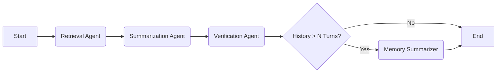

# IKMS Multi-Agent RAG System


[](https://ikms-multi-agent-rag.onrender.com) 

**Intelligent Knowledge Management System (IKMS)** is an advanced Retrieval-Augmented Generation (RAG) application capable of **multi-turn conversational reasoning**. Unlike standard RAG systems that treat every query in isolation, IKMS uses a multi-agent graph architecture to maintain context, resolve references, and manage long-term conversation history.

---

## Key Feature

This version implements **Conversational Multi-Turn QA with Memory**, transforming the system into a state-aware assistant.

* **Conversational Memory:** Remembers previous questions and answers to handle follow-up queries naturally (e.g., "What is HNSW?" → "What are **its** advantages?").
* **Session Management:** Create, switch between, and delete multiple independent chat sessions. Chats persist across browser refreshes.
* **Dynamic Knowledge Base:** Users can **upload, index, and delete** PDF documents directly via the UI.
* **Multi-Agent Orchestration:** Powered by **LangGraph**, utilizing specialized agents:
    * **Retrieval Agent:** Context-aware searching that reformulates queries based on history.
    * **Summarization Agent:** Synthesizes answers using both retrieved context and conversation history.
    * **Verification Agent:** Ensures answers are grounded in evidence to prevent hallucinations.
    * **Memory Agent:** Automatically summarizes long conversations to optimize token usage.
* **Transparency & Citations:** Visual badges ("Used History") indicate when the AI relies on memory versus fresh retrieval.
* **Ephemeral Cloud Deployment:** Dockerized setup optimized for serverless platforms like **Render**.

---

## Architecture

The system follows a linear multi-agent graph flow:



1. **State Management:** A robust `QAState` schema tracks `session_id`, `history`, and `conversation_summary` across turns.
2. **Vector Store:** Uses **Pinecone** for high-performance vector similarity search.
3. **Frontend/Backend:** Decoupled architecture with a **FastAPI** backend and **Streamlit** frontend.

---

## Prerequisites

* **Python 3.12+**
* **OpenAI API Key** (for GPT-3.5/4 and Embeddings)
* **Pinecone API Key** (Serverless Index)

---

## Installation & Setup

### 1. Clone the Repository

```bash
git clone https://github.com/danula-rathnayaka/ikms-multi-agent-rag
cd ikms-multi-agent-rag
```

### 2. Environment Configuration

Create a `.env` file in the root directory based on `.env.example`:

```bash
cp .env.example .env
```

**Required Variables:**

```ini
OPENAI_API_KEY=
PINECONE_API_KEY=
PINECONE_INDEX_NAME=
```

### 3. Install Dependencies

We use `uv` for lightning-fast dependency syncing.

```bash
uv sync
```

---

## Running the Application

The system requires both the Backend API and Frontend UI to be running.

### Option A: Using Docker

This builds a single container running both services.

```bash
# Build the image
docker build -t ikms-rag .

# Run the container
docker run -p 8000:8000 -p 8501:8501 --env-file .env ikms-rag
```

Access the UI at `http://localhost:8501`

### Option B: Manual Local Execution

Open two terminal windows.

**Terminal 1: Backend API**

```bash
uvicorn src.app.api:app --reload --port 8000
```

**Terminal 2: Frontend UI**

```bash
streamlit run src/app/streamlit.py
```

---

## Usage Guide

1. **Initialize Knowledge Base:**
* On first launch, you will see a "Knowledge Base Empty" screen.
* Open the **Sidebar** and use the **Upload Documents** expander.
* Upload a PDF. The system will index it into Pinecone.


2. **Start a Conversation:**
* Click **"New Conversation"** in the sidebar.
* Ask a question: *"What is the procedure for activating a SIM?"*


3. **Test Conversational Memory:**
* Ask a follow-up using pronouns: *"What happens if **it** fails?"*
* The agent will understand "it" refers to the activation process mentioned in the previous turn.
* Observe the **"↺ Used History"** badge appearing below the answer.


4. **Manage Files:**
* Expand **"Manage Files"** in the sidebar to see indexed documents.
* Click the **"✕"** icon to delete a document and its associated vectors from the database.

5. **Manage Conversations:**
* View your history in the **"Recent Conversations"** sidebar list.
* Click a title to resume a previous chat session.
* Click the **"✕"** icon next to a session to permanently delete that conversation.

---

## API Documentation

Once running, interactive API docs (Swagger UI) are available at:
`http://localhost:8000/docs`

**Key Endpoints:**

* `POST /qa/conversation`: Main RAG endpoint (creates/updates sessions).
* `GET /sessions`: List all active chat sessions.
* `DELETE /sessions/{session_id}`: Delete a specific conversation.
* `POST /index-pdf`: Ingestion pipeline for documents.
* `DELETE /documents/{filename}`: Vector and file cleanup.

---

## Project Structure

```text
src/
├── app/
│   ├── api.py            # FastAPI endpoints (Session, QA, Uploads)
│   ├── streamlit.py      # Streamlit Frontend UI
│   └── models.py         # Pydantic data models for API
├── core/
│   ├── agents/
│   │   ├── agents.py     # Agent logic (Retrieval, Summarization, etc.)
│   │   ├── graph.py      # LangGraph workflow definition
│   │   ├── prompts.py    # System prompts with history injection
│   │   └── state.py      # QAState schema definition
│   └── retrieval/
│       └── vector_store.py # Pinecone & PyPDFLoader integration
└── services/             # Business logic layer
```

---

## Deployment Strategy (Render)

**Live Demo:** [https://ikms-multi-agent-rag.onrender.com](https://ikms-multi-agent-rag.onrender.com)

This project is optimized for **Serverless Deployment** on Render.

**Challenge:** Serverless platforms have ephemeral filesystems. Files are wiped on restart. <br>
**Solution:** The system implements a **"Clean Slate Protocol"**.

1. **Lifespan Manager:** On server startup, the `lifespan` function in `api.py` triggers.
2. **Sync State:** It wipes the Pinecone Vector Index (`delete_all_vectors()`) and cleans the upload directory.
3. **Result:** This guarantees that the Vector Database always matches the (empty) filesystem on boot, preventing "ghost" search results.

---

## DevOps & CI/CD

To demonstrate enterprise readiness, we include configurations for Containerization, Infrastructure as Code, and CI/CD.

* **Docker:** Fully containerized application using a **multi-stage build** optimization (`uv` for fast dependency resolution + slim runtime image) to ensure consistent deployment across environments.
* **Jenkinsfile:** Defines a declarative CI pipeline to lint code, build the Docker image, and run quality checks.
* **Terraform:** (Conceptual) Infrastructure as Code (IaC) configuration for provisioning the serverless Pinecone vector index programmatically.

---

## Conclusion

The **IKMS Multi-Agent RAG System** demonstrates the transition from simple LLM wrappers to robust, state-aware cognitive architectures. By combining **LangGraph's** cyclic orchestration with **FastAPI's** asynchronous performance and **Pinecone's** vector search, this project delivers a scalable solution for complex knowledge management tasks.

It serves as a reference implementation for:
* **Agentic Design Patterns** (Retrieval, Reflection, Summarization)
* **Stateful AI Interactions** (Memory management, session handling)
* **Modern Python Tooling** (`uv`, `pydantic`, `docker`)